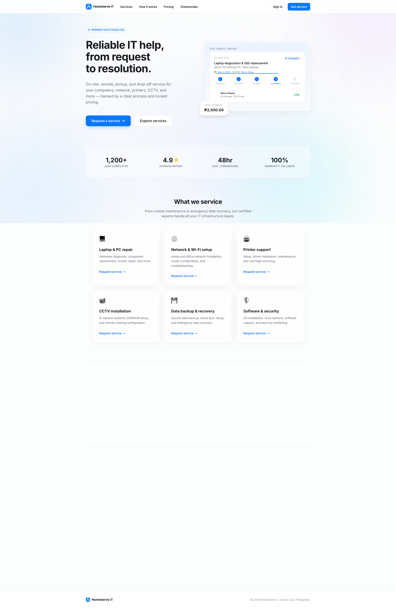
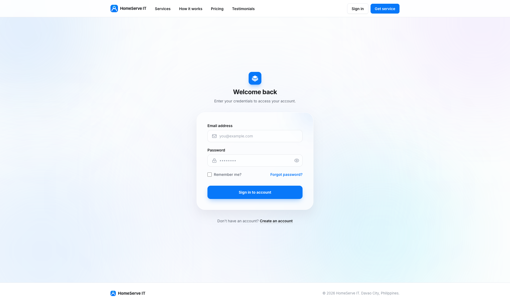
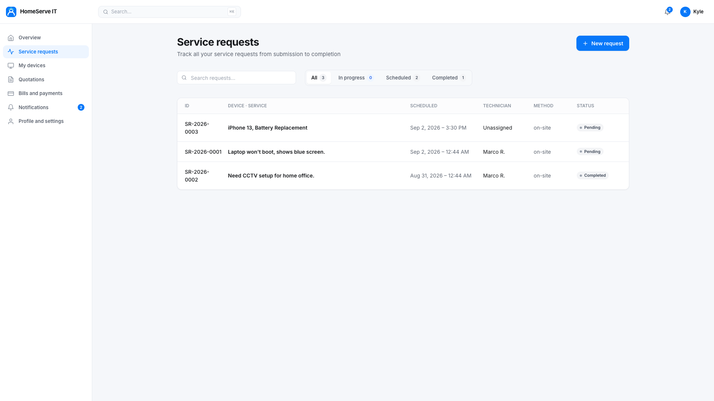
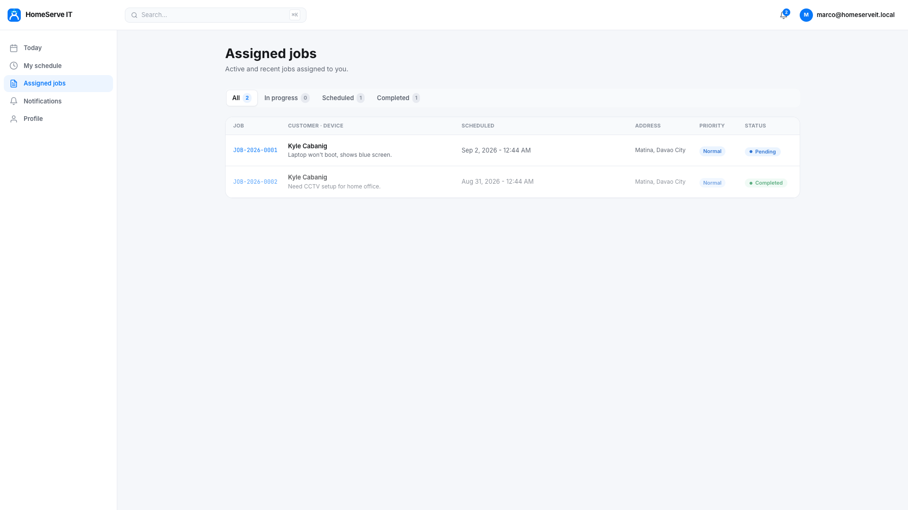
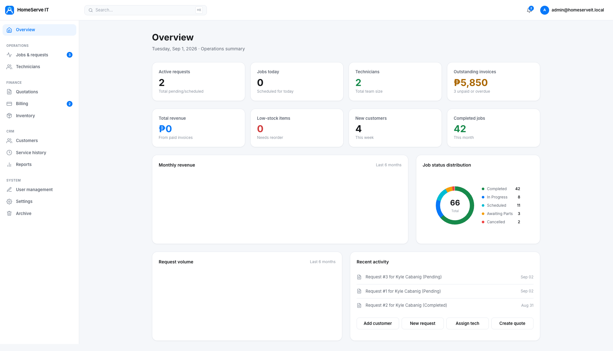
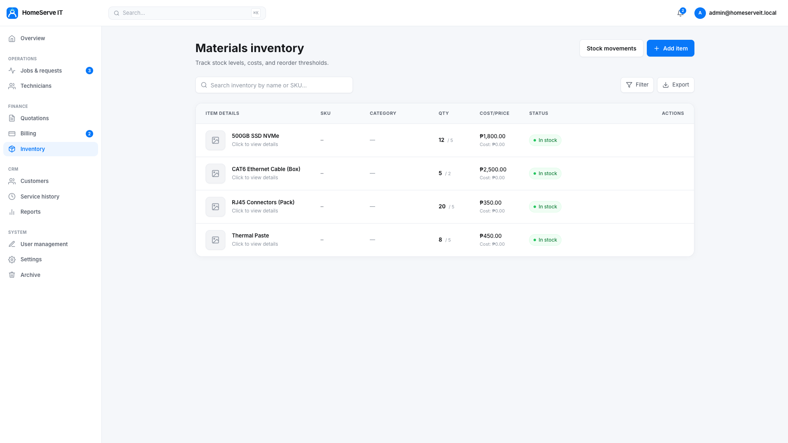
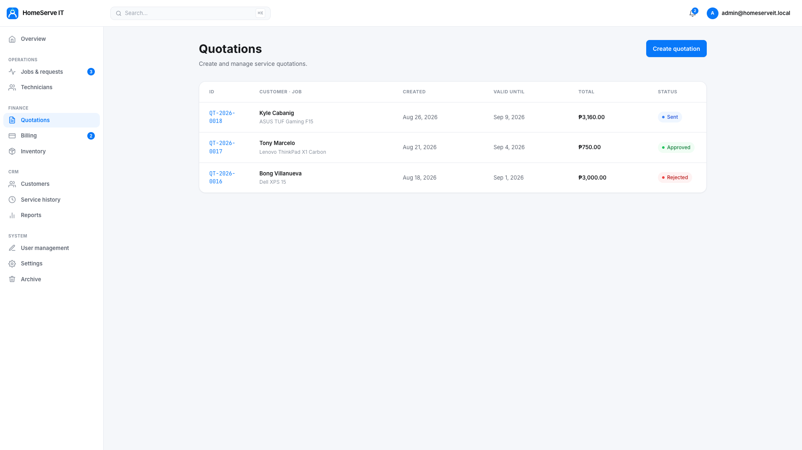
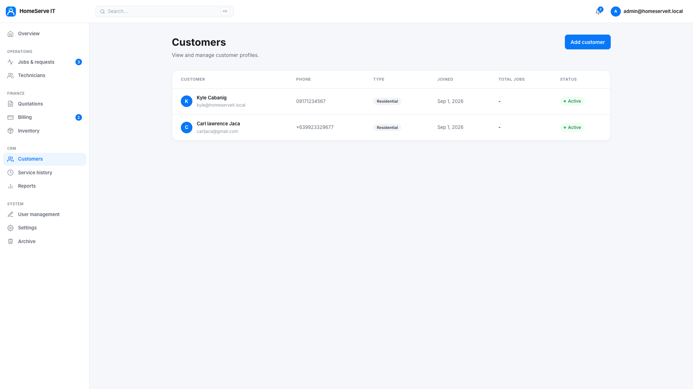

<h1 align="center">
  
  
  
  
</h1>

<h1 align="center">🛠️ HomeServe IT – IT Service Management System</h1>

<p align="center">
  A full-stack, role-based IT service management platform built as a final project for <strong>IT 15</strong>.<br/>
  Designed to digitize and streamline every step of a managed IT service operation — from customer service requests to technician dispatch, inventory, billing, and real-time communication.
</p>

---

## 📋 Table of Contents

- [Overview](#-overview)
- [System Architecture](#-system-architecture)
- [Roles & User Portals](#-roles--user-portals)
- [Features by Module](#-features-by-module)
  - [Customer Portal](#customer-portal)
  - [Technician Portal](#technician-portal)
  - [Admin Panel](#admin-panel)
- [Technology Stack](#-technology-stack)
- [Database Schema](#-database-schema)
- [Real-Time Features](#-real-time-features--signalr)
- [Workflow: Service Request Lifecycle](#-workflow-service-request-lifecycle)
- [Getting Started](#-getting-started)
- [Project Structure](#-project-structure)
- [Default Credentials (Dev Seed)](#-default-credentials-dev-seed)

---

## 🌐 Overview

**HomeServe IT** is a comprehensive IT service management web application. It replaces manual, paper-based or phone-based service coordination with a fully digital, multi-role platform. Customers can book and track IT service requests online. Technicians receive job assignments, manage checklists, and communicate with clients in real time. Administrators oversee operations, manage inventory, approve quotations, and handle billing — all from a unified, modern dashboard.

> Built as the final capstone project for **IT 15 (Information Technology 15 – Systems Development)**

<p align="center">
  
  
</p>

---

## 🏗️ System Architecture

```
HomeServe IT/
├── HomeServeIT.Web/              # ASP.NET Core 10 MVC Web Application
│   ├── Areas/
│   │   ├── Admin/                # Administrator portal (Operations, Finance, CRM, System)
│   │   ├── Customer/             # Customer-facing portal (Bookings, Devices, Payments)
│   │   ├── Technician/           # Technician portal (Jobs, Schedule, Chat)
│   │   └── Identity/             # ASP.NET Identity (Login, Register, Account)
│   ├── Models/                   # Entity Framework Core data models
│   ├── Data/                     # DbContext, migrations, database seeder
│   ├── Services/                 # Business logic services
│   ├── Hubs/                     # SignalR real-time hubs (Chat)
│   ├── Controllers/              # Public-facing routes (Landing, Home)
│   └── wwwroot/                  # Static assets (CSS, JS, images)
└── HomeServeIT.slnx              # .NET Solution file
```

The application uses an **Areas-based** routing pattern to separate concerns across the three user roles. Each area has its own controllers, views, and models — enforced by ASP.NET Identity role authorization.

---

## 👥 Roles & User Portals

| Role | Portal URL | Capabilities |
|------|-----------|-------------|
| **Customer** | `/Customer/` | Book service requests, track job status, chat with technician, view invoices, manage devices |
| **Technician** | `/Technician/` | View assigned jobs, update checklists, propose quotations, manage inventory, real-time chat |
| **Administrator** | `/Admin/` | Full system oversight — CRM, operations, inventory, billing, quotations, reporting, user management |

---

## ✨ Features by Module

### Customer Portal

| Feature | Description |
|---------|-------------|
| **Service Request Booking** | Customers submit IT service requests with issue description, priority, preferred schedule, photos, and device information |
| **Request Tracking** | Real-time status updates through the full lifecycle: Pending → In Progress → Completed |
| **Device Management** | Register and manage personal IT devices linked to service history |
| **Quotation Review** | View and accept/reject technician-proposed quotations before work begins |
| **Invoice & Payment** | View generated invoices and confirm payment online |
| **Real-Time Chat** | Persistent messaging with the assigned technician, powered by SignalR |
| **Notifications** | In-app notification feed for status changes, approvals, and messages |
| **Cancellation Requests** | Submit a cancellation request with a stated reason; admin reviews and approves/rejects |
| **Support Tickets** | Contact platform support for account or system issues |



---

### Technician Portal

| Feature | Description |
|---------|-------------|
| **Assigned Jobs Dashboard** | Card-based view of all current job assignments with priority and status indicators |
| **Job Drawer** | Side-panel detail view per job with four tabs: Details, Workflow, Messages, and Progress |
| **Diagnosis Workflow** | Pre-work verification checklist (review problem description and images) before starting |
| **5-Step Job Checklist** | Structured repair process: (1) Diagnostic, (2) Hardware, (3) Firmware/OS, (4) QA Testing, (5) Handover |
| **Quotation Proposal** | Technicians propose labor cost + parts breakdown; includes inventory item selection with live stock levels |
| **Inventory-Aware Quotation** | Parts are reserved from inventory when a quotation is submitted; deducted when approved |
| **Schedule View** | Calendar-style view of upcoming and past job schedule |
| **Real-Time Chat** | Persistent two-way messaging with the customer per job, backed by SignalR |
| **Job Completion** | Mark jobs as complete; triggers invoice generation and stock deduction audit trail |
| **Cancellation Workflow** | Handle customer cancellation requests; notify admin |



---

### Admin Panel

#### 📊 Dashboard
- Live KPI overview: total service requests, active technicians, pending invoices, open support tickets
- Revenue, job completion rate, and inventory alerts at a glance



#### ⚙️ Operations
- **Service Requests** – View, filter, assign technicians, update priorities, archive completed records
- **Technicians** – Add/edit/suspend technician profiles with real-time active job count and completion stats
- **Cancellation Management** – Approve or reject customer cancellation requests with optional rejection notes

#### 💰 Finance
- **Quotations** – Review technician-submitted quotations, verify inventory availability, approve with final pricing
- **Billing** – Issue invoices, mark payments as Paid, track outstanding balances
- **Inventory** – Manage materials (add, edit, restock, delete items with low-stock alerts)
- **Stock Movements** – Full audit trail of all inventory movements: who used each part, which job it went to, customer and location, restock events, and manual adjustments

<p align="center">
  
  
</p>

#### 👤 CRM
- Customer profiles with full service history
- Account management (view, edit, archive customers)



#### 🔔 Notifications
- Platform-wide notification management

#### 🛡️ System
- **User Management** – Create, edit, suspend, or archive Admin/Technician/Customer accounts
- **Role Management** – Assign and revoke role-based access

#### 📋 Reports
- Aggregate reporting on jobs, revenue, and technician performance

---

## 🛠️ Technology Stack

| Layer | Technology | Purpose |
|-------|-----------|---------|
| **Runtime** | .NET 10 (ASP.NET Core MVC) | Web framework, routing, DI, middleware |
| **Database** | MySQL 8 via Pomelo EF Core | Relational data persistence |
| **ORM** | Entity Framework Core 9 | Code-first migrations, LINQ queries |
| **Auth** | ASP.NET Core Identity | Role-based access control, password hashing, lockouts |
| **Real-Time** | ASP.NET Core SignalR | Live chat messaging and read receipts |
| **PDF Generation** | QuestPDF 2026 | Invoice and report PDF exports |
| **Frontend Styling** | Tailwind CSS 3.x (JIT) | Utility-first CSS; compiled via `npx tailwindcss` |
| **Frontend Interactivity** | Alpine.js | Lightweight reactive UI (modals, dropdowns, live state) |
| **Font** | Google Fonts — Inter | Typography across the entire application |
| **Dev Tools** | `dotnet watch`, EF Migrations | Hot reload, schema evolution |

---

## 🗃️ Database Schema

The database is managed entirely through **Entity Framework Core Code-First Migrations**.

### Core Entities

| Model | Table | Description |
|-------|-------|-------------|
| `ApplicationUser` | `AspNetUsers` | Extended Identity user (FullName, Role, DateCreated, archiving flags) |
| `Customer` | `Customers` | Customer profile linked to ApplicationUser |
| `Technician` | `Technicians` | Technician profile (Specialty, Availability) |
| `ServiceRequest` | `ServiceRequests` | Job ticket (Status, Priority, Checklist flags, Cancellation fields) |
| `Invoice` | `Invoices` | Invoice/Quotation (TotalAmount, PaymentStatus, IsQuotation flag) |
| `InventoryItem` | `InventoryItems` | Warehouse item (SKU, Stock, Cost, ReorderLevel) |
| `JobInventoryUsage` | `JobInventoryUsages` | Parts allocated per job (reservation & deduction tracking) |
| `StockMovement` | `StockMovements` | Full audit trail (who used it, where it went, quantity, value, timestamp) |
| `ServiceMessage` | `ServiceMessages` | Chat messages per service request (persisted, read-status) |
| `Device` | `Devices` | Customer-registered devices |
| `JobDeliverable` | `JobDeliverables` | Work output records per job |
| `SupportTicket` | `SupportTickets` | Internal support/help-desk tickets |
| `UserNotification` | `UserNotifications` | Per-user in-app notification records |

### Key Relationships
- A `ServiceRequest` belongs to one `Customer` and optionally one `Technician`
- A `ServiceRequest` has one `Invoice` (which may be a quotation)
- `JobInventoryUsage` links a `ServiceRequest` to multiple `InventoryItem` records
- `StockMovement` links to `InventoryItem` and optionally to `ServiceRequest`
- `ServiceMessage` links to a `ServiceRequest` with a sender (`ApplicationUser`)

---

## 📡 Real-Time Features — SignalR

The `ChatHub` (`/Hubs/ChatHub.cs`) powers real-time bidirectional messaging between customers and technicians:

- **Group-based isolation**: Each service request has its own SignalR group (`requestId`), ensuring messages are private
- **Role-aware authorization**: Admins can join any group; customers and technicians only access requests they are party to
- **Persistent messages**: Every message is written to the `ServiceMessages` table before being broadcast
- **Read receipts**: `MarkAsRead` events are broadcast to the group in real time

---

## 🔄 Workflow: Service Request Lifecycle

```
Customer Submits Request
        │
        ▼
  [Pending] ──► Admin Reviews & Assigns Technician
        │
        ▼
  Technician Submits Quotation (with Parts)
        │
        ▼
  Admin Approves Quotation ──► Customer Receives Invoice
        │
        ▼
  Customer Pays Invoice
        │
        ▼
  [In Progress] — Technician Completes Pre-Work Verification
        │           - Review problem description ✓
        │           - Review attached images ✓
        ▼
  5-Step Job Checklist:
    1. ✅ Diagnostic & Assessment
    2. ✅ Hardware Repair / Installation
    3. ✅ Firmware & OS Configuration
    4. ✅ Quality Assurance Testing
    5. ✅ Device Handover to Customer
        │
        ▼
  Inventory Parts Auto-Deducted → Stock Movement Logged
        │
        ▼
  [Completed] ──► Invoice Finalized ──► Customer Notified
```

---

## 🚀 Getting Started

### Prerequisites

- [.NET 10 SDK](https://dotnet.microsoft.com/download)
- [MySQL 8](https://dev.mysql.com/downloads/) running locally
- [Node.js & npm](https://nodejs.org/) (for Tailwind CSS compilation)
- [dotnet-ef CLI tool](https://learn.microsoft.com/en-us/ef/core/cli/dotnet): `dotnet tool install --global dotnet-ef`

### 1. Clone the Repository

```bash
git clone https://github.com/<your-username>/HomeServe-IT.git
cd "HomeServe-IT"
```

### 2. Configure the Database Connection

Edit `HomeServeIT.Web/appsettings.json`:

```json
{
  "ConnectionStrings": {
    "DefaultConnection": "Server=127.0.0.1;Database=HomeServeIT;User=root;Password=YOUR_PASSWORD;"
  }
}
```

### 3. Install Frontend Dependencies

```bash
cd HomeServeIT.Web
npm install
```

### 4. Apply Migrations & Seed the Database

```bash
dotnet ef database update --project HomeServeIT.Web
```

The database seeder (`DbInitializer.cs`) automatically runs on startup in the **Development** environment and creates:
- Default roles (Admin, Technician, Customer)
- Seed users (see credentials below)
- Sample inventory items
- Stock movement history

### 5. Run the Application

```bash
dotnet watch --project HomeServeIT.Web
```

The application will be available at `https://localhost:7XXX` (port shown in terminal).

---

## 📁 Project Structure

```
HomeServeIT.Web/
├── Areas/
│   ├── Admin/
│   │   ├── Controllers/
│   │   │   ├── DashboardController.cs       # KPI dashboard
│   │   │   ├── OperationsController.cs      # Jobs, technicians, cancellations
│   │   │   ├── FinanceController.cs         # Inventory, billing, quotations, stock movements
│   │   │   ├── CrmController.cs             # Customer management
│   │   │   ├── SystemController.cs          # User management, roles
│   │   │   ├── SupportController.cs         # Support tickets
│   │   │   └── NotificationsController.cs
│   │   └── Views/
│   │       ├── Dashboard/Index.cshtml
│   │       ├── Operations/ (ServiceRequests, Technicians)
│   │       ├── Finance/ (Inventory, StockMovements, Billing, Quotations)
│   │       ├── Crm/ (Customers, Customer detail)
│   │       └── System/ (UserManagement)
│   ├── Customer/
│   │   ├── Controllers/
│   │   │   ├── DashboardController.cs
│   │   │   ├── ServiceRequestsController.cs  # Booking, status, cancellation, payment
│   │   │   ├── QuotationsController.cs
│   │   │   ├── BillsAndPaymentsController.cs
│   │   │   ├── MyDevicesController.cs
│   │   │   └── SupportController.cs
│   │   └── Views/
│   └── Technician/
│       ├── Controllers/
│       │   ├── AssignedJobsController.cs     # Full job management & quotation workflow
│       │   ├── DashboardController.cs
│       │   └── ScheduleController.cs
│       └── Views/
│           └── AssignedJobs/Index.cshtml     # Main technician workspace (drawer UI)
├── Models/
│   ├── ApplicationUser.cs
│   ├── ServiceRequest.cs
│   ├── InventoryItem.cs
│   ├── JobInventoryUsage.cs
│   ├── StockMovement.cs                      # Inventory audit trail
│   ├── Invoice.cs
│   ├── ServiceMessage.cs
│   ├── Device.cs
│   ├── Technician.cs
│   ├── Customer.cs
│   └── UserNotification.cs
├── Data/
│   ├── ApplicationDbContext.cs               # EF Core DbContext
│   └── DbInitializer.cs                      # Dev seed data
├── Services/
│   ├── JobInventoryService.cs                # Inventory deduction + movement logging
│   ├── NotificationService.cs                # In-app notification delivery
│   ├── ServiceCancellationCleanup.cs         # Cleanup on cancellation
│   ├── InvoiceScopes.cs                      # EF query filters for invoices
│   └── ServiceRequestScopes.cs              # EF query filters for requests
├── Hubs/
│   └── ChatHub.cs                            # SignalR real-time chat
└── wwwroot/
    ├── css/site.css                          # Tailwind source styles
    └── js/site.js                            # Alpine.js page interactions
```

---

## 🔑 Default Credentials (Dev Seed)

> These accounts are created automatically when running in **Development** mode via `DbInitializer.cs`.

| Role | Email | Password |
|------|-------|----------|
| **Administrator** | `admin@homeserveit.local` | `Admin@123` |
| **Technician** | `marco@homeserveit.local` | `Tech@123` |
| **Customer** | `kyle@homeserveit.local` | `Cust@123` |

> ⚠️ **Do not use these credentials in production.** Change all passwords before deploying to any public environment.

---

## 👨‍💻 Author

**Kyle Christian Cabanig**  
IT 15 — Final Project  
*HomeServe IT – IT Service Management System*

---

## 📄 License

This project is submitted as an academic final project for IT 15. All rights reserved by the author.
